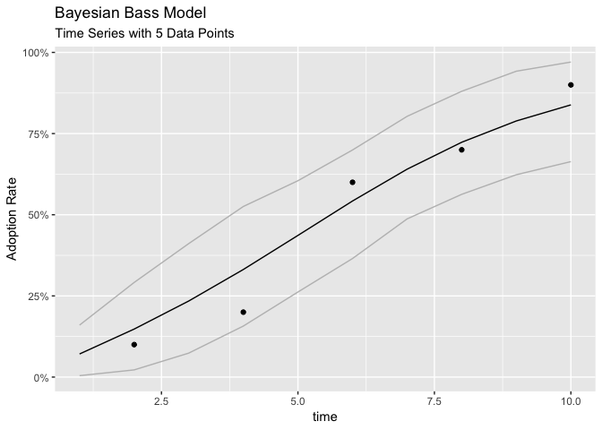

-   [Bayesian Bass Model](#bayesian-bass-model)
    -   [Bayesian Approach](#bayesian-approach)
    -   [Model Coefficients](#model-coefficients)
-   [Installation](#installation)
-   [Create a Bayesian Bass model](#create-a-bayesian-bass-model)
-   [Outlook](#outlook)

Bayesian Bass Model
===================

*bayesianbass* is a package to create Bass Diffusion Models with a Bayesian Approach.

The Bass model describes mathematically the uptake of innovations, products and behaviors. It is based on the Diffusion of innovation theory by Rogers. The model was first published in 1963 by Professor Frank M. Bass followed by a paper published in 1969 providing empricial evidence, that was missing up to this point.

Bayesian Approach
-----------------

The Bayesian approach offers advantages such as estimating a complete bivariate probability distribution of the model coefficients, which are described below, and additionally, the Bayesian model is able to incorporate prior knowledge about the coefficients.

Model Coefficients
------------------

The Bass model describes the uptake of a diffusion with two parameters, p and q, which are interpreted as coefficient of innovation and coefficient of imitation respectively. Both models describe the diffusion dynamics. You can find further information in Bass' publications and in [my blog post](https://sciphy-stats.netlify.com/post/estimating-the-bass-model/) which unfortunately is only available in German. Another good resource is Mannemeyer et al. (2005) which describes the basic Bass Model in the methods section.

This package provides functions to create Bayesian Bass Diffusion models with additional functions to plot the diffusion course and predict the uptake of an innovation.

Installation
============

Before you download the package, please make sure that you have `rjags` installed. The `bayesianbass` package uses `rjags` which offer implementations of Monte Carlo Markov Chains which simulate the posterior distribution of the Bayesian Bass Diffusion model.

Note that `rjags` requires a separate installation of `JAGS` (just another gibbs sampler). [You can find information about the installation of jags](http://mcmc-jags.sourceforge.net/). After the installation of `JAGS` install `rjags` via `install.packages(rjags)`.

Next install `bayesianbass` using `devtools`

``` r
devtools::install_github("jnshsrs/bayesianbass")
```

Create a Bayesian Bass model
============================

``` r
library(bayesianbass)
```

First, we need to specifiy our model, that is then simulated via rjags. Do do so, we create a character string describing the model. It also contains the prior distributions which are modeled as normal distributions for both model parameters, p and q. The default prior distribution is uncommital, which means that prior to the analysis no specific knowledge about model coefficients are incorporated. To get the default prior distributions, just run the `bayesian_bass_model` function without any arguments.

``` r
# We create the model description with uncommital prior
# Function returns a character string which is used by rjags to create the model
model <- bayesianbass::bayesian_bass_model()
```

In this example, we use a sample dataset containing two columns, first, the time index and second, the adoption status, indicating wether or not an entity is an adopter. This column may only contain 0 or 1, where the 0 represents a non-adopter and 1 represents an adopter. Please note, that the time index column is named `time_index`, the column containing the adoption status can be specified as string in the function call.

We use the model description as function argument to the `bayesian_bass` function.

``` r
# load sample adoption data
data(adoption_data)

# create model
fit <- bayesian_bass(data = adoption_data,
                     model = model,
                     var = "adoption",
                     plot_diagnostics = T,
                     n_iter = 1e4)
```

    ## Compiling model graph
    ##    Resolving undeclared variables
    ##    Allocating nodes
    ## Graph information:
    ##    Observed stochastic nodes: 50
    ##    Unobserved stochastic nodes: 2
    ##    Total graph size: 139
    ## 
    ## Initializing model


``` r
# display model coefficients
print(fit)
```

    ## # A tibble: 1 x 2
    ##        p     q
    ##    <dbl> <dbl>
    ## 1 0.0807 0.282

Next we plot the adoption for each point in time with the fitted bass model superimposed as adoption curve.

``` r
plot(fit, se = FALSE)
```


Furthermore, we can predict the expected uptake.

The function accepts integers as input to the interval parameter. This may be a single integer or a sequence of integers.

``` r
predicted_uptake <- predict(fit, interval = 2:4)
head(predicted_uptake)
```

    ## # A tibble: 3 x 2
    ##       t predicted
    ##   <int>     <dbl>
    ## 1     2     0.192
    ## 2     3     0.304
    ## 3     4     0.421

However, we did not use the advantages of the bayesian approach to Bass models, which will provide a complete distribution over parameters or predictions.

The following code will provide a complete probability distribution of the predicted uptake on time point t=3. We will see that the uptake will be most likely be around 20%.

``` r
pred_adoption <- bayesianbass::predict_adoption(fit, time = 3)
plot(pred_adoption)
```

    ## Warning: Removed 1 rows containing non-finite values (stat_density).


Since the plot function returns a ggplot object, we can simply edit the plot.

``` r
library(ggplot2)
```

    ## Warning: package 'ggplot2' was built under R version 3.5.2

``` r
plot(pred_adoption) + theme_minimal()
```

    ## Warning: Removed 1 rows containing non-finite values (stat_density).


We can also plot the complete diffusion course with the corresponding HDIs (Highes Density Intervals).

``` r
pred_diffusion <- predict_diffusion(fit)
plot(pred_diffusion)
```



The `bayesianbass::predict_diffussion` function contains additinal information. However no getter function exist, so you may use `purrr`'s `pluck` function to access its elements.

``` r
str(pred_diffusion)
```

    ## List of 3
    ##  $ diffusion_predicted:List of 10
    ##   ..$ : num [1:800] 0.15912 0.10002 0.07898 0.00728 0.03495 ...
    ##   ..$ : num [1:800] 0.302 0.2136 0.1739 0.0262 0.0916 ...
    ##   ..$ : num [1:800] 0.4272 0.3348 0.2816 0.0731 0.1779 ...
    ##   ..$ : num [1:800] 0.535 0.456 0.396 0.179 0.297 ...
    ##   ..$ : num [1:800] 0.625 0.569 0.51 0.37 0.441 ...
    ##   ..$ : num [1:800] 0.7 0.669 0.615 0.611 0.591 ...
    ##   ..$ : num [1:800] 0.761 0.752 0.707 0.807 0.724 ...
    ##   ..$ : num [1:800] 0.811 0.818 0.782 0.918 0.825 ...
    ##   ..$ : num [1:800] 0.851 0.868 0.842 0.968 0.894 ...
    ##   ..$ : num [1:800] 0.883 0.906 0.887 0.988 0.938 ...
    ##  $ diffusion_data     :Classes 'tbl_df', 'tbl' and 'data.frame': 10 obs. of  4 variables:
    ##   ..$ avg_adoption : num [1:10] 0.0773 0.1574 0.2456 0.3431 0.4473 ...
    ##   ..$ sdev_adoption: num [1:10] 0.0578 0.0861 0.0994 0.1003 0.0923 ...
    ##   ..$ hdi_lower    : num [1:10] 0.0056 0.0347 0.0723 0.1546 0.2698 ...
    ##   ..$ hdi_upper    : num [1:10] 0.193 0.341 0.438 0.535 0.626 ...
    ##  $ diffusion_actual   :Classes 'tbl_df', 'tbl' and 'data.frame': 5 obs. of  5 variables:
    ##   ..$ t    : num [1:5] 2 4 6 8 10
    ##   ..$ n    : int [1:5] 10 10 10 10 10
    ##   ..$ Lower: num [1:5] 0 0 0.3 0.4 0.7
    ##   ..$ avg  : num [1:5] 0.1 0.2 0.6 0.7 0.9
    ##   ..$ Upper: num [1:5] 0.3 0.5 0.9 1 1
    ##  - attr(*, "class")= chr "bayesian_bass_diffusion"

``` r
purrr::pluck(pred_diffusion, "diffusion_data")
```

    ## # A tibble: 10 x 4
    ##    avg_adoption sdev_adoption hdi_lower hdi_upper
    ##           <dbl>         <dbl>     <dbl>     <dbl>
    ##  1       0.0773        0.0578   0.00560     0.193
    ##  2       0.157         0.0861   0.0347      0.341
    ##  3       0.246         0.0994   0.0723      0.438
    ##  4       0.343         0.100    0.155       0.535
    ##  5       0.447         0.0923   0.270       0.626
    ##  6       0.552         0.0832   0.375       0.702
    ##  7       0.648         0.0804   0.496       0.808
    ##  8       0.728         0.0829   0.581       0.893
    ##  9       0.792         0.0856   0.621       0.939
    ## 10       0.840         0.0859   0.658       0.972

Outlook
=======

This packages contains the main functions to fit and plot a Bayesian Bass Model and predict future uptake of innovations. However, some functions such as getter functions are still missing. I do not plan to develop this package further in the near future, but maybe people in innovation science may find it useful. Feel free to clone and add new features to this package.
